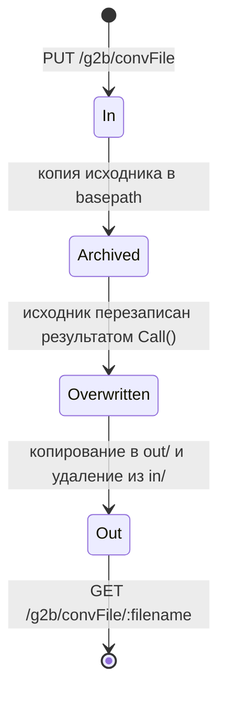

# Database

> **Назначение:** описание модели данных. У сервиса нет собственной БД — этот файл фиксирует, где на самом деле живёт состояние и как устроено единственное хранилище проекта: файловое.
> **Связано с:** [Architecture.md](./Architecture.md), [Glossary.md](./Glossary.md)
> **Обновлено:** 2026-08

---

## Общая информация

- **СУБД: не используется.** Ни PostgreSQL, ни MySQL, ни встроенного хранилища.
- `internal/repository` содержит пустую структуру `Repository` и конструктор — задел, который никогда не наполнялся. `app.New()` создаёт её и передаёт в `service.New()`, где она сохраняется, но не используется.
- Драйвер `mongo-driver` в `go.mod` — транзитивная зависимость Gin, не признак работы с MongoDB.

**Источник истины — процессинг D8.** Карты, счета, клиенты, транзакции хранятся там; сервис каждый раз запрашивает данные заново.

---

## Где живёт состояние

| Данные | Где | Время жизни |
|--------|-----|-------------|
| Карты, счета, клиенты, транзакции | D8 (MISS/Kernel) | постоянно, вне зоны ответственности сервиса |
| OFFLINE-пакеты и результаты их обработки | файловая система контейнера / тома хоста | до ручной очистки |
| Cookie-сессия портала D8 | память процесса (`cookiejar` + `config.Config.Processing.Token`) | до перезапуска или следующего `Signin` |
| Учётные записи клерков | константа в коде `auth.ClerksMap` | до пересборки |
| Метрики | память процесса | до перезапуска |
| Логи | stdout → файл на хосте | по политике хоста |

Практическое следствие: **перезапуск сервиса теряет только сессию портала**, всё остальное восстанавливается само. Обратная сторона — нет ни аудита обработанных запросов, ни возможности повторить неудачную операцию.

---

## Файловое хранилище

Единственное персистентное хранилище проекта. Пути задаются в `config.json`:

```json
"storage": {
    "basepath": "/app/files/d8-partnerapi_docs/Examples/OffLine",
    "in":  "/in",
    "out": "/out"
}
```

Пути склеиваются конкатенацией строк, поэтому `in`/`out` обязаны начинаться со слэша.

### Раскладка каталогов

| Каталог | Том на хосте | Назначение |
|---------|--------------|------------|
| `<basepath>/in` | `/srv/g2b/files/in` | Входящие пакеты, ожидающие обработки |
| `<basepath>/out` | `/srv/g2b/files/out` | Результаты обработки, доступны через `GET /g2b/convFile/:filename` |
| `<basepath>` | `/srv/g2b/files/history` | Архив исходных файлов (копия до перезаписи результатом) |

### Схема имени файла

```
<Тип>_<timestamp>.xml
```

Тип обязан совпадать с одной из масок `utils.OfflineReqTypes`, иначе загрузка отклоняется с `400`:

`CreateCardsOut`, `CreateCustomerAndAccount`, `CreateOrganizations`, `CreatePreIssuedCards`, `CreateStatusActivationsOut`, `ReissueCardsOut`, `RelinkPreIssuedCardsOut`, `RelinkPreIssuedCardStatusActivationsOut`.

### Права доступа

| Объект | Права | Где выставляются |
|--------|-------|------------------|
| Каталог `in` | `0755` | `os.MkdirAll` при первой загрузке |
| Загруженный файл | `0776` | явный `os.Chmod` в `PutConvFile` |
| Копии при перемещении | наследуются от исходника | `copyFile` |

Права `0776` на файлы с персональными данными избыточны — обусловлены тем, что каталоги смонтированы с хоста и с ними работают внешние процессы.

---

## Жизненный цикл записи



Реализация — `pkg/storage.MoveFile(sourcePath, destPath, base, content)`:

1. копирует исходник в `basepath/<имя>` (архив);
2. если `content != nil` — перезаписывает исходник результатом обработки;
3. копирует в `out/<имя>` и удаляет из `in/`.

Особенности, важные при разборе инцидентов:

- ошибка архивирования (шаг 1) не проверяется — обработка продолжится, архива может не быть;
- при ошибке `Call()` файл всё равно проходит весь путь, и в `out/` окажется **текст ошибки** вместо результата;
- повторной обработки нет: файл из `out/` не возвращается в `in/` автоматически.

---

## Модель данных пакета

Содержимое файла — `<ROOT>` со списком `<RECORD>`. Универсальная запись `models.MRecord` (`internal/models/OFFLINE/models.go`) насчитывает около 150 полей:

| Группа | Примеры полей |
|--------|---------------|
| Персональные данные | `FIO`, `LATFIO`, `BIRTHDAY`, `SEX`, `TITLE` |
| Паспорт | `PASNOM`, `PASDAT`, `PASEXPDAT`, `PASDEP` |
| Резидентство | `RESIDENT`, `COUNTRYRES`, `EXTID`, `PCODE` |
| Адреса | `ADDRESS`/`RESADDRESS`/`CORADDRESS` + разложенные компоненты (индекс, страна, регион, город, улица, дом, корпус, квартира) |
| Контакты | `EMAIL`, `PHONE`, `CELLPHONE`, `FAX` |
| Работа | `COMPANY`, `JOB`, `SALARY`, `STARTJOB` |
| Счёт | `ACCOUNT`, `EXTACCOUNT`, `ACCTTYPE`, `ACCTSTAT`, `CURRENCYNO` |
| Карта | `PAN`, `EXTERNALID`, `CRDSTAT`, `NAMEONCARD`, `CVV`, `CVV2`, `IPVV` |
| Секретная информация | `SECRETINFO` (кодовое слово) |

Часть пакетов объявляет собственный, более узкий `Record` вместо общего `MRecord`.

**Разбор ФИО позиционный**: `FIO` делится по пробелу, где `[0]` — телефон, `[1]` — фамилия, `[2]` — имя; `LATFIO` — фамилия и имя латиницей. При ином порядке слов данные разъедутся молча.

---

## Что делать, если понадобится БД

Признаки того, что момент настал: требование аудита запросов партнёра, ретраи неудачных OFFLINE-пакетов, идемпотентность MDI, дедупликация повторных загрузок.

Тогда потребуется:

1. наполнить `internal/repository` реальными методами и передавать его в `service` (каркас для этого уже есть);
2. добавить миграции и выбрать инструмент (в контуре чаще используется PostgreSQL);
3. пересмотреть `ConvScanner`: перенести состояние обработки файла из «положения на диске» в таблицу со статусами.

До этого момента любое «сохранение» в сервисе означает запись файла на смонтированный том.
