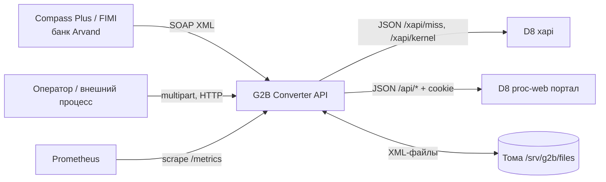

# Integrations

> **Назначение:** карта всех внешних систем, с которыми взаимодействует сервис. Помогает быстро понять зависимости, blast radius при инцидентах и где искать креды/контракты.
> **Связано с:** [Architecture.md](./Architecture.md), [Deployment.md](./Deployment.md)
> **Обновлено:** 2026-08

---

## Как читать этот файл

- Каждая интеграция = отдельный раздел.
- Группировка: **Входящие** (кто ходит к нам), **Процессинг D8** (основная зависимость), **Инфраструктурные**.
- Для каждой интеграции фиксируем: назначение, направление, протокол, адреса, аутентификацию, критичность, поведение при отказе.

---

## Карта зависимостей

---

## Уровни критичности

| Уровень | Что значит | Что происходит при отказе |
|---------|------------|----------------------------|
| 🔴 **Critical** | Без интеграции основной flow не работает | Все операции возвращают ошибку |
| 🟡 **Important** | Критичен для части функций | Отдельные операции недоступны |
| 🟢 **Optional** | Можно жить без него | Логируем, продолжаем работать |

---

## Входящие

### Compass Plus (FIMI) — банк Arvand
- **Назначение:** источник ONLINE-запросов: информация по картам и счетам, выписки, POS-авторизация, статусы, CMS-уведомления.
- **Направление:** Compass → наш сервис (sync).
- **Протокол:** SOAP 1.2 поверх HTTP, `POST /g2b/d8convert`.
- **Аутентификация:** пара `Clerk` + `Password` в атрибутах `<Request>`, проверка по SHA-256 из `auth.ClerksMap`.
- **Контракт:** XSD Compass — `fimi.xsd`, `fimi_types.xsd` (пространства имён `http://schemas.compassplus.com/two/1.0/...`). В репозитории схем нет, версия контракта не зафиксирована.
- **Критичность:** 🔴 Critical — это основной потребитель.
- **Owner:** [заполнить контакт со стороны банка].

---

### Загрузка OFFLINE-пакетов
- **Назначение:** пакетная эмиссия карт, создание клиентов, счетов, организаций, перевыпуск, перепривязка.
- **Направление:** внешний процесс → наш сервис (`PUT /g2b/convFile`), затем обратное чтение результата (`GET /g2b/convFile/:filename`).
- **Протокол:** HTTP multipart / поток файла.
- **Аутентификация:** API-ключ (`Authorization` или `X-API-Key`).
- **Критичность:** 🟡 Important — задержка обработки не влияет на ONLINE-канал.
- **Особенность:** файлы могут попадать в каталог `in` и напрямую через смонтированный том, минуя HTTP.

---

## Процессинг D8

Одна система, два независимых транспорта — при инциденте проверять оба.

### D8 xapi (прямые вызовы)
- **Назначение:** карты, PIN, CVV, статусы, MDI, транзакции.
- **Направление:** наш сервис → D8 (sync).
- **Протокол:** HTTP + JSON.
- **Адрес:** `processing.address` из `config.json`; текущий стенд — `http://d8-tprocweb1.humo.lab`. **HTTP без TLS.**
- **Аутентификация:** отдельной нет; используются заголовки `utils.D8HeadersMap`. Для `initiateTransaction` добавляются `utils.D8TxHeadersMap` с **demo-значениями клиентского сертификата** (`CN=Test Company CA`) — для продуктива их нужно заменить.
- **Таймаут:** 90 секунд, клиент создаётся заново на каждый вызов.
- **Пути:**

| Контур | Путь | Назначение |
|--------|------|------------|
| MISS | `/xapi/miss/1.0/getCardInfo` | Агрегат карты |
| MISS | `/xapi/miss/1.0/getCardBasicInfo` | Базовый блок по `lkeyId` |
| MISS | `/xapi/miss/1.0/setPIN` | Установка PIN |
| MISS | `/xapi/miss/1.0/setCardStatus` | Смена статуса |
| MISS | `/xapi/miss/1.0/resetCardPINTries` | Сброс счётчика неверных PIN |
| MISS | `/xapi/miss/1.0/getCVV2` | Получение CVV2 |
| MISS | `/xapi/miss/1.0/mdi` | Массовые изменения (13 мест вызова) |
| Kernel | `/xapi/kernel/1.0/initiateTransaction` | Получение `ecTxRefno` |
| Kernel | `/xapi/kernel/1.0/authorizeTransaction` | Авторизация, проверка статуса и отмена — **все три на одном URL** |
| Kernel | `/xapi/kernel/1.0/getTransactionDetails` | Детали операции |
| Kernel | `/xapi/kernel/1.0/getCardTransactionHistory` | История по карте |

- **Критичность:** 🔴 Critical.
- **Поведение при отказе:** ретраев нет, первая же ошибка транспорта превращается в SOAP Fault партнёру. Circuit breaker отсутствует — при недоступности D8 каждый запрос будет висеть до 90 секунд.

---

### D8 proc-web (портал, сессионные вызовы)
- **Назначение:** выборки списков — карты клиента, счета, терминалы; создание организаций.
- **Направление:** наш сервис → портал (sync).
- **Протокол:** HTTP + JSON, cookie-сессия.
- **Адрес:** тот же `processing.address`.
- **Аутентификация:** `POST /api/login` с логином и паролем; cookie хранится в `cookiejar` общего клиента, первая cookie дублируется в `config.Config.Processing.Token`.
- **Креды:** **захардкожены в `pkg/d8-proc-web/auth.go`** — учётная запись `mustafokulovsh@humo.tj`. Ротация требует пересборки образа; при инциденте с утечкой менять пароль в процессинге и в коде одновременно.
- **Таймаут:** `app.client_timeout_seconds` (30 секунд).
- **Поддержание сессии:** фоновая задача каждые 30 секунд вызывает `Signin()`; отдельные операции логинятся точечно перед вызовом.
- **Пути:**

| Путь | Назначение |
|------|------------|
| `/api/login`, `/api/logout` | Сессия |
| `/api/miss/v1/getCardList` | Карты клиента по `custcode` и валюте |
| `/api/miss/v1/getAccountList`, `/api/miss/v1/getAccount` | Счета |
| `/api/pos/v1/getTerminalList` | Терминал по TID |
| `/api/kernel/v1/addCompany` | Создание организации |

- **Формат запроса:** `{"filters":[{"column":"accnum","values":["..."]}]}`.
- **Критичность:** 🔴 Critical для операций со счетами, выписками и POS.
- **Поведение при отказе:** `Signin` возвращает `Portal connection failed`; зависящие операции отдают ошибку. Fallback отсутствует.

---

## Инфраструктурные

### Файловое хранилище (тома хоста)
- **Назначение:** OFFLINE-пакеты и результаты. Подробнее — [Database.md](./Database.md).
- **Адреса:** `/srv/g2b/files/{in,out,history}` на хосте → `/app/files/d8-partnerapi_docs/Examples/OffLine/...` в контейнере.
- **Критичность:** 🔴 Critical для OFFLINE-канала.
- **Поведение при отказе:** каталог `in` создаётся автоматически при загрузке; при недоступности тома загрузка отдаёт `500`, `ConvScanner` пишет ошибки в лог каждый тик.

### Prometheus
- **Назначение:** сбор метрик, `GET /metrics`.
- **Направление:** Prometheus → наш сервис (scrape).
- **Аутентификация:** нет — эндпоинт открыт.
- **Критичность:** 🟢 Optional.

### GitLab Registry / Nexus
- **Назначение:** хранение образов и базовых образов сборки (`hub.docker.humo.lab`).
- **Критичность:** 🟡 Important — влияет только на сборку и деплой.

---

## Чего нет

Осознанно или по недоработке — но при планировании изменений на это рассчитывать нельзя:

- ретраев, backoff и circuit breaker при вызовах D8;
- TLS в сторону процессинга (весь трафик по HTTP внутри контура);
- отдельных метрик по интеграциям (`integration_requests_total` и подобных) — есть только метрики входящих HTTP-запросов;
- алертов на недоступность процессинга;
- фиксации версии контракта FIMI в репозитории.

---

## Чек-лист при добавлении новой интеграции

- [ ] Раздел в этом файле заполнен.
- [ ] Креды **не** попадают в код и в `config.json` в репозитории.
- [ ] Заданы таймаут и понятное поведение при отказе.
- [ ] Ошибка интеграции преобразуется в осмысленный ответ партнёру, а не в текст внутренней ошибки.
- [ ] Вызов логируется без секретов (PIN, пароли, полный PAN).
- [ ] Указан owner на нашей стороне.

---

## Аварийные контакты

| Система | Способ связи | SLA |
|---------|--------------|-----|
| Процессинг D8 (Humo) | [заполнить] | [заполнить] |
| Compass / банк Arvand | [заполнить] | [заполнить] |
| Инфраструктура контура | [заполнить] | [заполнить] |
