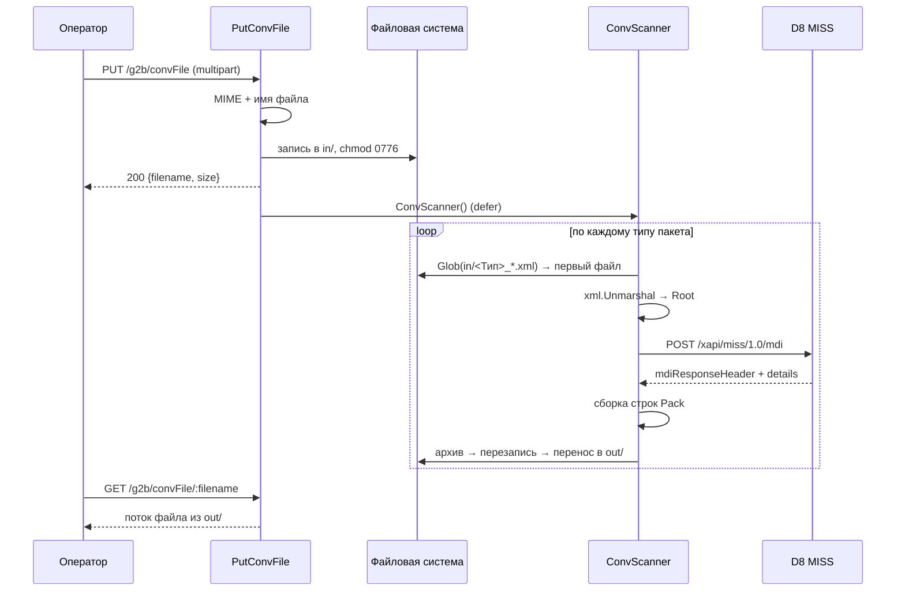

# Workflow: Обработка OFFLINE-пакета

> **Назначение:** пакетная обработка XML-файлов партнёра — эмиссия карт, создание клиентов, счетов и организаций, перевыпуск и перепривязка.
> **Триггер:** `PUT /g2b/convFile` и периодический тик `ConvScanner` (по умолчанию раз в 60 секунд)
> **Связано с:** [Database.md](../Database.md), [Glossary: MDI](../Glossary.md#mdi-master-data-interface)
> **Обновлено:** 2026-08

---

## Контекст

Массовые операции нельзя провести через ONLINE-канал: они меняют справочные данные и выполняются пакетами по сотням записей. Партнёр выгружает XML-файл, сервис преобразует его в MDI-запрос к процессингу и возвращает результат отдельным файлом.

Восемь типов пакетов:

| Тип файла | Что делает | Вызывает |
|-----------|------------|----------|
| `CreateCardsOut_*.xml` | Эмиссия карт | `AddCardsG2b` |
| `CreateCustomerAndAccount_*.xml` | Создание клиента и счёта | `CreateCustomersAndAccountsG2b` |
| `CreateOrganizations_*.xml` | Создание организаций | `AddCompaniesG2b` |
| `CreatePreIssuedCards_*.xml` | Преперсонализированные карты | `AddPreissiedCardG2b` |
| `ReissueCardsOut_*.xml` | Перевыпуск карт | `ReissueCardG2b` |
| `RelinkPreIssuedCardsOut_*.xml` | Перепривязка предэмиссии | `RelinkPreissiedCardG2b`, `AddCardAcctLinkG2b`, `DeleteCardAcctLinkG2b` |
| `CreateStatusActivationsOut_*.xml` | Активации статусов | вызова D8 нет — файл возвращается как есть |
| `RelinkPreIssuedCardStatusActivationsOut_*.xml` | Активация после перепривязки | вызов D8 закомментирован — файл возвращается как есть |

---

## Участники

| Компонент | Слой | Ответственность |
|-----------|------|------------------|
| `handlers.PutConvFile` | Handlers | Приём файла, валидация, запись в `in` |
| `jobs.ConvScanner` | Jobs | Периодический обход типов, оркестрация обработки |
| `jobs.unmarshalFromFormat` | Jobs | Поиск файла по маске и разбор в `Root` нужного пакета |
| `models/OFFLINE/<Op>.Root.Call()` | Models | Сборка MDI и вызов процессинга |
| `service/G2B/mdi*.go` | Service | `POST /xapi/miss/1.0/mdi` |
| `pkg/storage.MoveFile` | Infrastructure | Архивирование, запись результата, перенос |
| `handlers.GetConvFile` | Handlers | Отдача результата из `out` |

---

## Основной сценарий

### Загрузка

1. **[Handlers]** `PutConvFile` читает первые 512 байт и проверяет MIME: обязан быть ровно `text/xml; charset=utf-8`.
2. **[Handlers]** Имя файла проверяется по префиксам `utils.OfflineReqTypes`; несовпадение → `400`.
3. **[Handlers]** Каталог `in` создаётся при отсутствии (`0755`), файл сохраняется и получает права `0776`.
4. **[Handlers]** Клиенту отдаётся `200` с именем и размером файла, после чего отложенным вызовом синхронно запускается `ConvScanner()`.

### Обработка

5. **[Jobs]** `ConvScanner` захватывает пакетный мьютекс — параллельных проходов не бывает.
6. **[Jobs]** Для каждого из восьми типов выполняется `filepath.Glob(in/<маска>)`; берётся **только первый** найденный файл.
7. **[Jobs]** Файл читается `storage.LoadFile` и анмаршалится в `Root` соответствующего пакета.
8. **[Models]** `Root.Call()` перебирает записи и собирает `MdiFile`: на каждую запись — один или несколько `MdiRecordDetails` со сквозным `ISS_RECNUM` (`utils.NewSequence()`).
9. **[Service]** `POST /xapi/miss/1.0/mdi`; успех — `C_ACTIONCODE == "0"` в заголовке ответа.
10. **[Models]** По деталям ответа формируется результат: на каждую успешную запись — строка `Pack` вида `CustomerId:CustomerCode:AccNum:AccNum:CurrencyCode:LkeyAlias:CardPan`, где `CardPan` берётся из `KL_LKEY_CLR`.
11. **[Infrastructure]** `MoveFile`: копия исходника в корень `basepath` (архив) → перезапись исходника результатом → копирование в `out/` → удаление из `in/`.

### Выгрузка

12. **[Handlers]** `GetConvFile` отдаёт файл из `out/` потоком по 8 КБ с `Content-Disposition: attachment`.

---

## Альтернативные сценарии

### Неверный тип файла
MIME не `text/xml; charset=utf-8` (например, XML без BOM определился иначе) или имя не совпало с маской → `400`, файл не сохраняется.

### Ошибка разбора XML
`unmarshalFromFormat` возвращает ошибку → она логируется, тип пропускается, файл **остаётся в `in/`** и будет разбираться заново каждый тик.

### Ошибка вызова процессинга
`Call()` вернул ошибку → она логируется, но файл всё равно проходит весь путь: в `out/` окажется **текст ошибки** вместо результата, исходник останется только в архиве. Повторной обработки нет — файл придётся класть в `in/` заново вручную.

### Частичный отказ MDI
Обработка деталей ответа прерывается на первой записи с `C_ACTIONCODE != "0"` (`break`). Записи до неё уже применены в процессинге, записи после — не попадут в результат. Пакет оказывается применён частично, и по файлу результата это не видно.

### Несколько файлов одного типа
Обрабатывается только `matches[0]`; остальные ждут следующего тика. При частой загрузке очередь разбирается по одному файлу в минуту на тип.

### Пустой каталог
Штатная ситуация, но логируется как `Errorf("Empty matches …")` — в логах это выглядит как ошибка каждый тик по каждому типу.

---

## Side effects

- Изменяются справочные данные в процессинге: клиенты, счета, карты. Откат возможен только встречной MDI-операцией.
- Повторная загрузка того же файла приведёт к повторному применению записей — идемпотентности у MDI нет.
- В логи попадает полное тело MDI-запроса, включая персональные данные и открытые PAN из ответа.
- `PutConvFile` запускает `ConvScanner` синхронно после отправки ответа: при большом пакете HTTP-соединение уже закрыто, но горутина продолжает удерживать мьютекс, и очередной тик планировщика будет ждать.

---

## Диаграмма

---

## Метрики и мониторинг

- Отдельных метрик у джоба нет: успешность видна только по логам (`[JOBS] Converter scanner`, `writin' <тип>`).
- Признак проблемы — файлы, накапливающиеся в `in/`: значит, разбор падает и файл не переносится.
- Признак скрытой ошибки — в `out/` лежит короткий файл с текстом ошибки вместо строк `Pack`.
- Полезно завести алерт на количество файлов в `in/` старше нескольких тиков.
