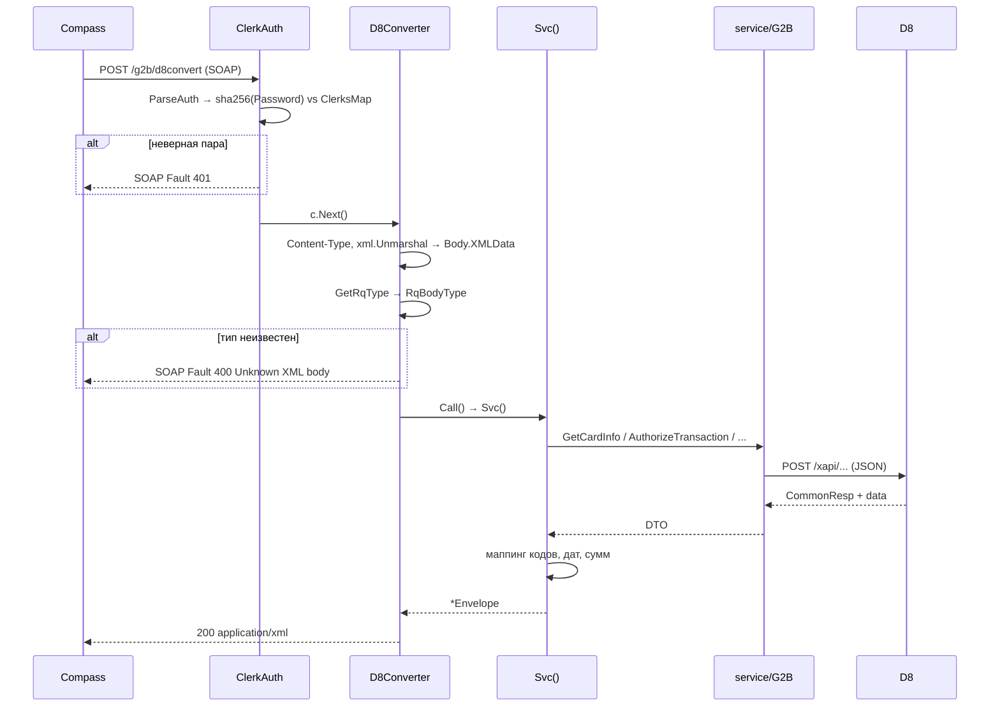

# Workflow: Обработка ONLINE-запроса

> **Назначение:** общий конвейер обработки синхронного SOAP-запроса партнёра — от аутентификации до ответа в формате FIMI.
> **Триггер:** `POST /g2b/d8convert`
> **Связано с:** [API.md](../API.md), [Architecture.md](../Architecture.md), [Glossary: ONLINE-операция](../Glossary.md#online-операция)
> **Обновлено:** 2026-08

---

## Контекст

Банк-партнёр говорит на SOAP-протоколе Compass FIMI, процессинг D8 принимает JSON. Сервис должен:

- проверить учётные данные клерка, переданные внутри тела запроса;
- определить, какая именно операция запрошена — по имени корневого тега, а не по URL;
- разобрать тело в структуру конкретной операции;
- выполнить один или несколько вызовов процессинга;
- собрать ответ в XML, который ожидает FIMI.

Этот процесс — «зонтик» для 20+ операций. Специфика конкретной операции живёт в `Svc()` её пакета.

---

## Участники

| Компонент | Слой | Ответственность |
|-----------|------|------------------|
| `middlewares.ClerkAuth` | Presentation | Проверка `Clerk` + SHA-256 пароля |
| `handlers.D8Converter` | Handlers | Content-Type, разбор конверта, диспетчеризация |
| `utils.GetRqType` | Utils | Определение типа операции по имени тега |
| `models/ONLINE/<Op>.Call()` | Models | Обёртка над `Svc()` |
| `models/ONLINE/<Op>.Svc()` | Models | Маппинг FIMI ↔ D8, вызовы процессинга |
| `service/G2B/*` | Service | HTTP-вызовы D8 |
| `handlers.SendSoapFault` | Handlers | Формирование SOAP Fault |

---

## Основной сценарий

1. **[Presentation]** `ClerkAuth` читает тело целиком и восстанавливает его для последующего чтения; пустое тело → Fault `400`.
2. **[Presentation]** `auth.ParseAuth` нестрогим XML-декодером достаёт атрибуты `Clerk` и `Password` элемента `<Request>`.
3. **[Presentation]** Логин ищется в `auth.ClerksMap`, пароль сверяется как `hex(sha256(password))`; несовпадение → Fault `401`.
4. **[Handlers]** `D8Converter` проверяет `Content-Type` — допустимы `application/soap+xml`, `text/xml`, `application/xml`; иначе `415`.
5. **[Handlers]** Тело разбирается в `models.SoapEnvelope`; внутренний XML сохраняется как `Body.XMLData` без разбора.
6. **[Handlers]** `utils.GetRqType` потоково ищет первый элемент, имя которого есть в `utils.BodyTypes`.
7. **[Handlers]** `switch` по типу: тело анмаршалится в структуру операции, вызывается `Call()`.
8. **[Models]** `Svc()` при `debug_mode` подставляет срок действия карты по умолчанию из `processing.extra`, если он не пришёл.
9. **[Models → Service]** Выполняются вызовы `service/G2B` — от одного (`GetCardInfoRq`) до пяти (`POSRequestRq`).
10. **[Models]** Собирается `Envelope`: три пространства имён, `Ver`/`Product`/`Echo` из запроса, `ResponseAttr="1"`, `TranId` из времени, поля данных — через справочники `utils.CardStatuses`, `utils.Currencies` и конвертеры дат.
11. **[Handlers]** Ответ отдаётся как `c.XML(200, resp)` с `Content-Type: application/xml; charset=utf-8`.

---

## Альтернативные сценарии

### Неизвестный тип запроса
`GetRqType` вернул `Unknown`, либо тип есть в `BodyTypes`, но нет ветки в `switch` (`DeleteCard2AcctLinkRq`, `SetCardPersonRq`) → Fault `400 Client / Unknown XML body`.

### Ошибка разбора тела операции
`xml.Unmarshal` в структуру операции упал → лог `Errorf` с именем пакета, наружу Fault `500 Client / Internal server error`. Детали ошибки партнёру не раскрываются.

### Ошибка вызова процессинга
`Svc()` вернул ошибку → Fault `400 Client / Service error: <текст>`. Текст внутренней ошибки уходит партнёру как есть.

### Процессинг недоступен
Клиент `utils.SendRequest` ждёт до 90 секунд, затем ошибка транспорта → тот же Fault `400`. Ретраев нет; при массовой недоступности D8 каждый запрос будет держать соединение все 90 секунд.

### Операции-заглушки
`AcctCreditRq`, `AcctDebitRq`, `InitSessionRq` возвращают корректный по структуре ответ **без обращения к процессингу** — с фиксированными значениями. Это надо помнить при отладке: успешный ответ здесь ничего не доказывает.

---

## Side effects

- `SOAPLogger` **не** висит на этом маршруте, но `ClerkAuth` пишет тело запроса уровнем Debug — при `debug_mode: true` пароль клерка попадает в лог.
- Каждый запрос инкрементирует метрики `http_requests_total`, `http_request_duration_seconds`, при статусе ≥ 400 — `http_errors_total`, и переставляет gauge `service_status`.
- Ряд операций (`GetAcctStatementRq`) выполняет `Signin`/`Signout` портала D8, что переустанавливает общую cookie-сессию процесса.

---

## Диаграмма

---

## Метрики и мониторинг

- `http_requests_total{endpoint="/g2b/d8convert"}` — общий поток операций.
- `http_request_duration_seconds` — рост latency почти всегда означает деградацию D8, а не сервиса.
- `http_errors_total{status="400"}` — сюда попадают и ошибки формата, и бизнес-отказы процессинга: разделить их можно только по логам.

Отдельных метрик по типам операций нет — при необходимости их стоит добавить меткой `rq_type`.
