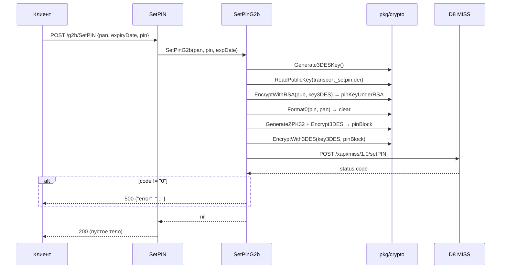

# Workflow: Установка PIN

> **Назначение:** установка нового PIN по карте с шифрованием PIN-блока по требованиям процессинга.
> **Триггер:** `POST /g2b/SetPIN`
> **Связано с:** [API.md](../API.md), [Glossary: PIN-блок](../Glossary.md#pin-блок)
> **Обновлено:** 2026-08

---

## Контекст

PIN нельзя передавать в открытом виде. Процессинг D8 принимает его в виде PIN-блока, зашифрованного одноразовым 3DES-ключом, который, в свою очередь, зашифрован транспортным RSA-ключом процессинга. Сервис отвечает за построение этой конструкции.

Реализация — `service.SetPinG2b(pan, pin, expDate)` в `internal/service/G2B/pin.go`, криптографические примитивы — в `pkg/crypto/`.

---

## Участники

| Компонент | Слой | Ответственность |
|-----------|------|------------------|
| `handlers.SetPIN` | Handlers | Разбор JSON-запроса |
| `crypto.Generate3DESKey` | Infrastructure | Генерация одноразового 16-байтового ключа с нечётной чётностью байтов |
| `crypto.ReadPublicKey` | Infrastructure | Чтение транспортного RSA-ключа из `internal/app/files/transport_setpin.der` |
| `crypto.EncryptWithRSA` | Infrastructure | Шифрование 3DES-ключа (PKCS#1 v1.5) |
| `crypto.Format0` | Infrastructure | Построение PIN-блока формата ISO-0 из PIN и PAN |
| `crypto.GenerateZPK32`, `crypto.Encrypt3DES` | Infrastructure | Шифрование PIN-блока зональным ключом |
| `crypto.EncryptWith3DES` | Infrastructure | Шифрование результата одноразовым ключом (3DES-ECB) |
| `service.SetPinG2b` | Service | Сборка `SetPinReq` и вызов `/xapi/miss/1.0/setPIN` |

---

## Основной сценарий

1. **[Handlers]** `SetPIN` разбирает JSON `{"pan":"...","expiryDate":"...","pin":"..."}`; ошибка разбора → `400`.
2. **[Service]** `crypto.Generate3DESKey()` — 16 случайных байт, каждый корректируется до нечётной чётности.
3. **[Service]** `crypto.ReadPublicKey("internal/app/files/transport_setpin.der")` — транспортный ключ процессинга; путь относительный, поэтому в контейнере файл должен быть смонтирован.
4. **[Service]** `crypto.EncryptWithRSA(publicKey, key3DES)` → `pinKeyUnderRSA`.
5. **[Service]** `crypto.Format0(pin, pan)` → PIN-блок в открытом виде.
6. **[Service]** `crypto.GenerateZPK32()` + `crypto.Encrypt3DES(zpk, clear)` → зашифрованный PIN-блок.
7. **[Service]** `crypto.EncryptWith3DES(key3DES, pinBlock)` → финальный `pinBlock` (режим ECB, длина обязана быть кратна 8 байтам).
8. **[Service]** Сборка `SetPinReq`: `CardKey` (PAN + срок), `pinKeyUnderRSA` и `pinBlock` в hex, `pinBlockType: 0`.
9. **[Service]** `POST /xapi/miss/1.0/setPIN`; успех — `status.code == "0"`.
10. **[Handlers]** При успехе обработчик **ничего не пишет в ответ** — клиент получает `200` с пустым телом. При ошибке — `500` и `{"error":"<текст>"}`.

---

## Альтернативные сценарии

### Нет транспортного ключа
`ReadPublicKey` не нашёл `transport_setpin.der` → `500` с текстом `read public key error`. Самая частая причина отказа в контейнере: Dockerfile не копирует каталог `internal/app/files/`, а рабочий каталог влияет на относительный путь. Рядом лежит `transport_setpin_old.der` — предыдущая версия ключа, в коде не используется.

### PIN некорректной длины
`crypto.Format0` вернёт ошибку → `500` с текстом `pin block format0`.

### Длина блока не кратна 8
`EncryptWith3DES` вернёт `data length … is not a multiple of block size` → `500`.

### Отказ процессинга
`status.code != "0"` → `500` и текст `"<rspcode> - <message>"` от D8.

### Проверка результата
Тело ответа процессинга не разбирается: соответствующий блок закомментирован, проверяется только статус.

---

## Side effects

- PIN карты меняется в процессинге — операция необратима, откат возможен только повторной установкой.
- **PIN попадает в логи в открытом виде:** маршрут закрыт middleware `SOAPLogger`, который пишет тело любого запроса, включая JSON с полем `pin`. Дополнительно `logger.Infof` печатает сгенерированный 3DES-ключ, PIN-блок и полный `SetPinReq`.
- Ключ 3DES одноразовый: он не сохраняется и не переиспользуется между вызовами.

---

## Диаграмма

---

## Смежная операция: сброс счётчика неверных PIN

`ResetBadPINTriesRq` (ONLINE-канал) → `service.ResetCardPINTriesG2b` → `POST /xapi/miss/1.0/resetCardPINTries`. Криптография не задействована, передаётся только `CardKey`. Применяется, когда карта заблокирована по превышению попыток ввода PIN (статус D8 `10`).

---

## Смежная операция: проверка PIN

`VerifyPINRq` (ONLINE-канал) → `service.VerifyPinStatusG2b` → `POST /xapi/miss/1.0/verifyPIN`.
PIN-блок собирается тем же `buildPinRequest`, что и для `setPIN`.

Неверный PIN - это не ошибка сервиса, а обычный ответ: партнёру уходит
`AuthRespCode` в кодировке TWO (`1` - верный, `53` - неверный, `62` - попытки
исчерпаны, `54` - сбой процессинга) и `DeclineReason` с текстом причины. SOAP
Fault остаётся только для некорректного запроса - пустых `PAN` или `PIN`.

Тот же вызов доступен как отдельный JSON-маршрут `POST /g2b/VerifyPIN` - им
пользуется наш мобильный банк, который SOAP не говорит.

Каждая неудачная попытка увеличивает счётчик неверных вводов в процессинге и в
итоге блокирует карту, поэтому операция идёт в паре с `ResetBadPINTriesRq`.

---

## Метрики и мониторинг

- Отдельных метрик нет; операция видна как `http_requests_total{endpoint="/g2b/SetPIN"}`.
- При разборе инцидента ориентироваться на строки `[SERVICE] D8 G2b setPIN resp status`.
- Логи этого маршрута содержат секреты — доступ к `app.log` должен быть ограничен так же, как доступ к самим PIN.
