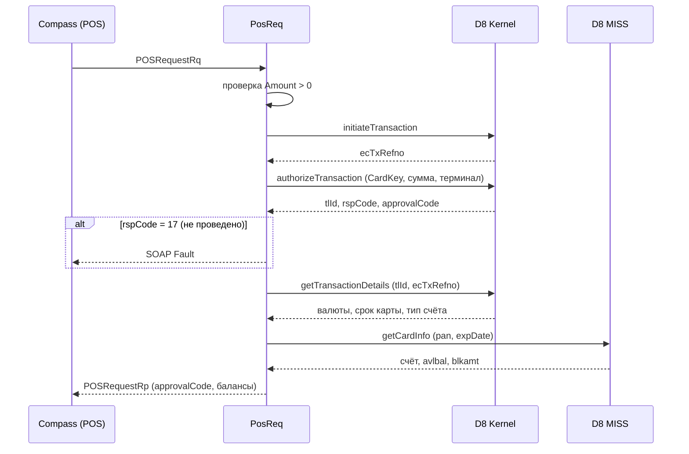

# Workflow: POS-авторизация

> **Назначение:** проведение финансовой операции по карте, инициированной POS-терминалом партнёра.
> **Триггер:** `POST /g2b/d8convert` с корневым тегом тела `POSRequestRq`
> **Связано с:** [online-soap-conversion.md](./online-soap-conversion.md), [Integrations.md](../Integrations.md), [Glossary: ecTxRefno](../Glossary.md#транзакционная-ссылка-ectxrefno)
> **Обновлено:** 2026-08

---

## Контекст

Самый сложный ONLINE-сценарий: единственный, где сервис выполняет цепочку из нескольких вызовов процессинга, причём часть из них — финансовые и неотменяемые. Задача:

- получить транзакционную ссылку `ecTxRefno`;
- отправить операцию на авторизацию в D8 Kernel;
- получить детали проведённой операции и текущие балансы карты;
- собрать ответ FIMI с кодом авторизации, балансами и валютами.

Реализация — `internal/models/ONLINE/POSRequest/service.go`, функция `PosReq`.

---

## Участники

| Компонент | Слой | Ответственность |
|-----------|------|------------------|
| `posrequestrq.PosReq` | Models | Оркестрация всей цепочки |
| `service.InitiateTransaction` | Service | `POST /xapi/kernel/1.0/initiateTransaction` → `ecTxRefno` |
| `service.AuthorizeTransaction` | Service | `POST /xapi/kernel/1.0/authorizeTransaction` |
| `service.GetTransactionDetailsG2b` | Service | `POST /xapi/kernel/1.0/getTransactionDetails` |
| `service.GetCardInfo` | Service | `POST /xapi/miss/1.0/getCardInfo` — балансы и валюта счёта |
| `models.TrnInputIface` | Models | Абстракция входа: PAN, срок, сумма, валюта, терминал, точка приёма |

---

## Основной сценарий

1. **[Models]** Проверка суммы: `Amount <= 0` → немедленная ошибка `Wrong 'Amount' field value`.
2. **[Service]** `InitiateTransaction()` → `ecTxRefno`. Вызывается с расширенными заголовками `utils.D8TxHeadersMap` (включая demo-заголовки клиентского сертификата).
3. **[Service]** `AuthorizeTransaction(req, ecTxRefno)` формирует `AuthTxReq`: `CardKey` (PAN + срок), тип операции, сумма, валюта, `TermCode`, `CrdacptID`, `CrdacptBus = 5999`, `MessageFunction = 0` (Request), `DestinationAccType = "00"`.
4. **[Service]** Ответ проверяется двумя условиями: `status.code == "0"` и непустой `ecTxRefno` в `transactionResponse`.
5. **[Models]** Из ответа в запрос переносятся `ThisTranId` (`tlId`), `RespCode`, `ApprovalCode`.
6. **[Models]** Если `RespCode` равен `17` (`AdviceLogNotProceed`) — операция считается непроведённой, возвращается ошибка.
7. **[Service]** `GetTransactionDetailsG2b(tlId, ecTxRefno)` — детали проведённой операции: валюта операции, валюта расчёта, срок действия карты, тип счёта назначения.
8. **[Service]** `GetCardInfo(pan, dateExp)` — счёт, доступный остаток `avlbal` и заблокированная сумма `blkamt`.
9. **[Models]** Сборка `POSRequestRp`: `ApprovalCode`, `AuthRespCode`, `AvailBalance` (`%.2f` от `avlbal`), `LedgerBalance` (`avlbal + blkamt`), валюты через `utils.Currencies`, `FromAcct` — номер счёта, `ToAcct` — тип счёта назначения.
10. **[Handlers]** Ответ отдаётся партнёру как XML.

---

## Альтернативные сценарии

### Сумма некорректна
`Amount <= 0` → ошибка до любого обращения к процессингу. Финансовых последствий нет.

### Не получен `ecTxRefno`
`InitiateTransaction` вернул пустое поле или ошибку → цепочка прерывается, авторизация не выполняется.

### Отказ авторизации
`status.code != "0"` → возвращается `"<code> - <message>"` от процессинга. Партнёр получает SOAP Fault `400`, а не структурированный отказ с кодом — различить технический сбой и отказ эмитента по ответу нельзя, только по тексту.

### Потеря ответа авторизации
Штатная и опасная ситуация: транзакция может быть проведена в процессинге, а ответ не дойти. В `service/G2B/transactions.go` для этого есть `GetTransactionStatus(tlId, ecTxRefNo)`, **но в текущем сценарии `PosReq` он не вызывается** — при обрыве связи после `authorizeTransaction` сервис вернёт ошибку, хотя средства могли быть списаны. Сверку в этом случае надо выполнять вручную по `ecTxRefno`.

### Ошибка получения деталей
Ошибка `GetTransactionDetailsG2b` логируется, но выполнение продолжается. Дальше `trnDetails` проверяется на `nil`, однако `cardInfo` затем используется без проверки — если детали получить не удалось, обращение к `cardInfo.CardBasicInfo` приведёт к панике в горутине запроса. Gin вернёт `500` через `Recovery`.

### Отмена операции
`ReverseTransaction(input, ecTxRefno, originalEcTxRefno)` реализован в сервисном слое, но из `PosReq` не вызывается: автоматической компенсации при частичном сбое цепочки нет.

---

## Side effects

- Операция изменяет баланс карты в процессинге — единственный необратимый шаг во всём сервисе.
- Полное тело запроса и ответа авторизации пишется в лог уровнем Info, включая PAN.
- Собственной записи о проведённой операции сервис не хранит: восстановить историю можно только из логов и из D8.

---

## Диаграмма

---

## Метрики и мониторинг

- Отдельных метрик по авторизациям нет: операция видна только как одна из записей `http_requests_total{endpoint="/g2b/d8convert"}`.
- Практический ориентир — рост `http_request_duration_seconds` на этом эндпоинте: цепочка делает до пяти последовательных вызовов, поэтому она первой реагирует на замедление процессинга.
- При разборе спорной операции искать в логах `ecTxRefno` и `tlId` — они пишутся в строках `[SERVICE] D8 G2b authorizeTransaction resp`.
